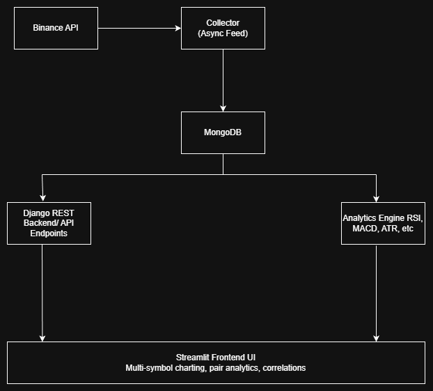

# GemsCap Quant Platform

A comprehensive full-stack **quantitative analytics and trading platform** integrating:
-  Real-time data collection from **Binance WebSocket API**
- ️ Data storage in **MongoDB**
-  Backend powered by **Django REST Framework**
-  Interactive analytics dashboard using **Streamlit**

Developed as part of the **Quant Developer Assignment**, the platform combines automated data ingestion, advanced analytics, and live visualization in a unified environment.

---

## Project Overview

The system continuously streams market data, computes analytics (RSI, MACD, Bollinger Bands, ATR, VWAP, etc.), detects mean reversion and correlation opportunities, and presents visual insights via Streamlit.  

It supports both **symbol-level analytics** and **pair-based analytics** (cointegration, correlation, and half-life of mean reversion).

---

## Project Structure

```
gemscap-quant/
├─ manage.py
├─ backend_django/
│  ├─ settings.py
│  ├─ urls.py
│  └─ wsgi.py
├─ api/
│  ├─ views.py
│  ├─ urls.py
│  └─ serializers.py
├─ analytics/
│  ├─ analytics.py
│  └─ indicators.py
├─ collector/
│  └─ collector.py
├─ streamlit_app/
│  └─ app.py
├─ run_all.py
├─ requirements.txt
└─ README.md
```

---

## Setup Instructions

### Clone Repository
```bash
git clone https://github.com/<your-username>/gemscap-quant.git
cd gemscap-quant
```

### Create Virtual Environment
```bash
python -m venv gemscap_env
gemscap_env\Scripts\activate      # Windows
# source gemscap_env/bin/activate  # macOS/Linux
```

### Install Dependencies
```bash
pip install -r requirements.txt
```

### Start MongoDB
Ensure MongoDB is running locally:
```
mongodb://localhost:27017
```

### Launch the Project
```bash
python run_all.py
```

- Django Backend → http://127.0.0.1:8000/api/  
- Streamlit Dashboard → http://localhost:8501  

---

## Dependencies

| Component | Library |
|------------|----------|
| Web Framework | Django, Django REST Framework |
| Frontend | Streamlit, Plotly |
| Database | MongoDB, PyMongo |
| Data & Analytics | pandas, numpy, statsmodels |
| Collector | websockets, asyncio |
| Misc | requests, logging |

---

## Methodology

### Data Collection
- Asynchronous WebSocket connection to Binance streams (`BTCUSDT`, `ETHUSDT`, etc.)
- Real-time tick data written to MongoDB

### Data Resampling
- Resamples raw tick data into OHLCV bars using pandas
- Supported intervals: **1s**, **1m**, **5m**
- Cleans missing or duplicate timestamps

### Analytics Modules

| Category | Features |
|-----------|-----------|
| Indicators | RSI, MACD, EMA, SMA, Bollinger Bands, VWAP, ATR |
| Correlation | Multi-symbol correlation matrix |
| Cointegration | Engle–Granger test, half-life computation |
| Mean Reversion | Z-score, RSI divergence |
| Volatility | ATR and Bollinger width analysis |

### Statistical Methods
- Engle–Granger cointegration for mean-reverting pairs  
- Rolling z-score for spread normalization  
- Half-life estimation using AR(1) regression  
- Volatility measures based on ATR and standard deviation

---

## Analytics Explanation

| Metric | Description |
|--------|--------------|
| **RSI** | Measures momentum; overbought/oversold detection |
| **MACD** | EMA-based trend indicator |
| **Bollinger Bands** | Volatility envelopes based on standard deviation |
| **ATR** | Measures volatility magnitude |
| **VWAP** | Volume-weighted average price |
| **Cointegration** | Detects mean-reverting relationships |
| **Half-Life** | Rate at which spreads revert to mean |
| **Rolling Z-score** | Standardized spread for entry/exit thresholds |
| **RSI Divergence** | Detects potential reversals |
| **Correlation Matrix** | Pairwise dependency visualization |

---

## API Endpoints

| Endpoint | Method | Description |
|-----------|---------|-------------|
| `/api/get_ohlc?symbol=btcusdt&tf=1m` | GET | Returns OHLCV bars |
| `/api/pair_analytics?x=btcusdt&y=ethusdt` | GET | Pairwise correlation and beta |
| `/api/pair_cointegration?x=btcusdt&y=ethusdt&window=60` | GET | Cointegration & half-life |
| `/api/corr_heatmap` | POST | Correlation matrix for symbols |

---

## ChatGPT Usage Transparency

This project was co-developed with **ChatGPT (GPT-5)** for:
- Designing architecture and folder structure  
- Implementing REST and Streamlit integration  
- Adding quantitative analytics functions (RSI, MACD, ATR, VWAP, Bollinger, Cointegration)  
- Writing this README and documentation  

### Example Prompts
- “Give me a Django + Streamlit architecture for quant analytics.”  
- “Add RSI, MACD, and Bollinger Bands to analytics.py.”  
- “Write a run_all.py script to start backend, collector, and frontend together.”  

All generated code was **reviewed, optimized, and tested manually**.

---

## System Architecture

  
[Download `.drawio` source](architecture.drawio)

### Flow Overview
1. Binance WebSocket streams → Collector → MongoDB  
2. Django REST API → Aggregates OHLCV + analytics  
3. Analytics Engine → Computes indicators & stats  
4. Streamlit → Interactive dashboard visualization  

---

## High-Level Flow (ASCII Diagram)

```
        ┌────────────┐       ┌──────────────┐
        │ Binance API│──────▶│ Collector    │
        └────────────┘       │ (Async Feed) │
                             └─────┬────────┘
                                   │
                                   ▼
                            ┌────────────┐
                            │ MongoDB DB │
                            └─────┬──────┘
                                   │
           ┌────────────────────────┴────────────────────────┐
           ▼                                                 ▼
   ┌──────────────────────┐                       ┌──────────────────────┐
   │ Django REST Backend  │                       │ Analytics Engine     │
   │  /api endpoints      │                       │ RSI, MACD, ATR, etc. │
   └──────────┬───────────┘                       └──────────┬───────────┘
              │                                              │
              ▼                                              ▼
        ┌────────────────────────────────────────────────────────┐
        │               Streamlit Frontend UI                    │
        │  Multi-symbol charting, pair analytics, correlations   │
        └────────────────────────────────────────────────────────┘
```

---

## Future Enhancements

- Add live updating Streamlit charts using WebSocket feed  
- Implement backtesting engine for mean reversion  
- Add alerting system for RSI/ATR signals  
- Integrate broker API for paper/live trading execution  

---

## Author

**Hemendra Sakpal**  
Quant Developer | Python Algo Trading | Market Analytics  
 [hemendra.sakpal@gmail.com]  
 [LinkedIn](https://www.linkedin.com/in/hemendra-sakpal-9a8134139/)

---
